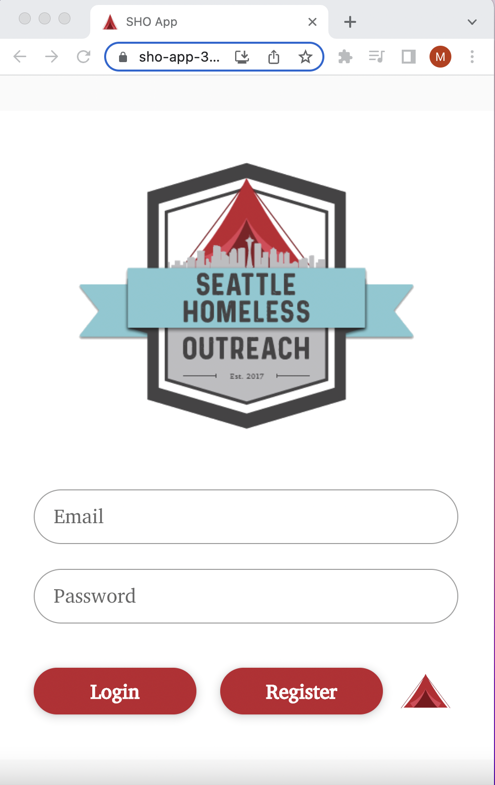
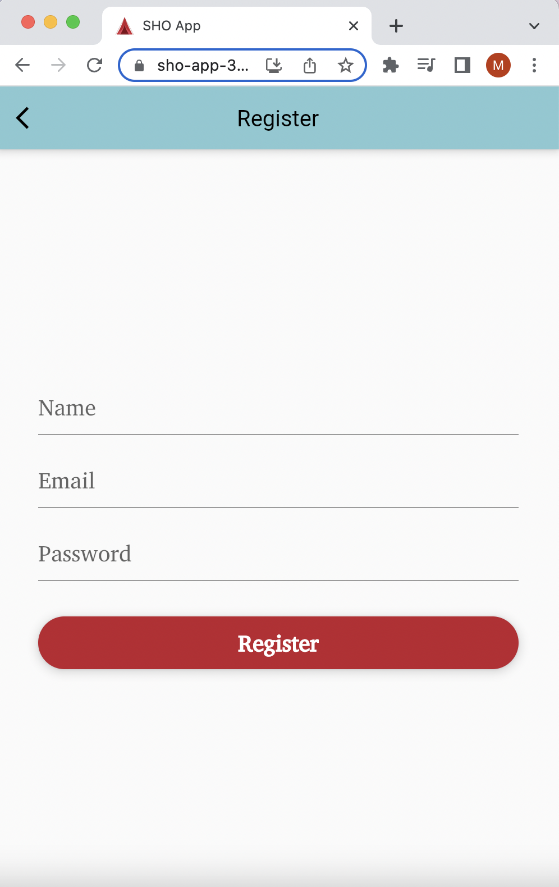
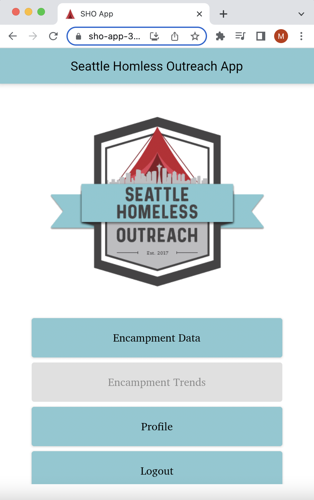
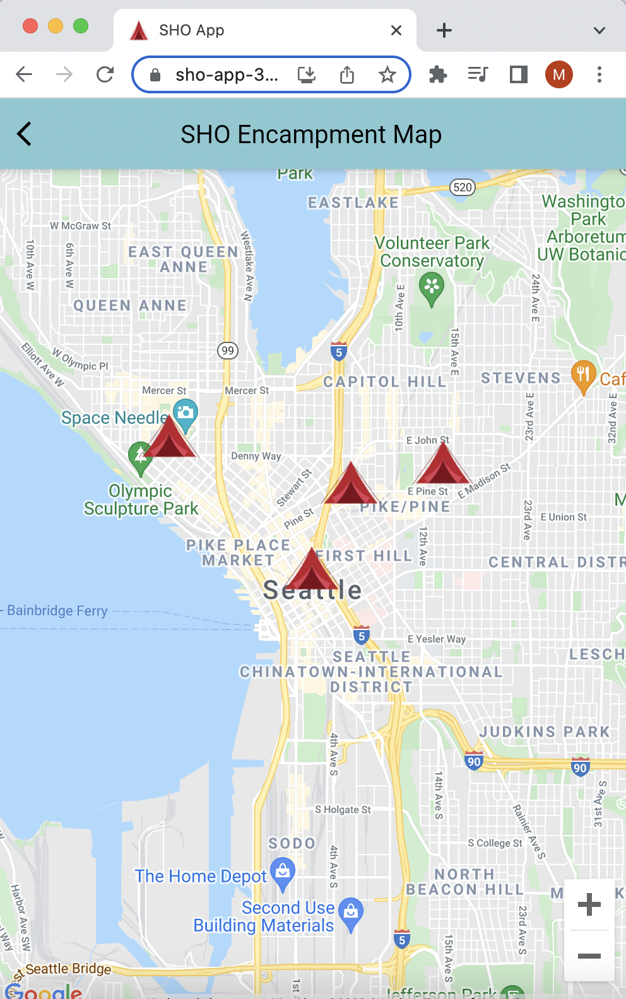

# Seattle Homeless Outreach App
Seattle Homeless Outreach is a 501(c)3 nonprofit geared to bringing essential supplies to people experiencing homelessness.  This app would allow for volunteers to track the growth of encampments and supplies distributed therein.

## Feature Set
Users may register and login with email password authentication, or they can login with a pre-existing google account.  On the main navigation page, users can view their profile, logout, or view an encampment map.

### Encampment Map
The encampment map allows users to view the location of previously marked encampments, record details for an outreach at a camp including number of tents seen and number of bags distributed, and establish a new encampment in the database with a camp name and a description, preferably containing details on location.

## Dependencies
Seattle Homeless Outreach was built using Flutter and relies on the following to run:

- Google Firebase
  - Firebase/Core
  - Firebase/RealTime Database
  - Firebase/Authentication
- Google Maps Flutter Plugin

## Environment Set-up

### VS Code Installation
Visual Studio Code is a source-code editor made by Microsoft for Windows, Linux and macOS. Features include support for debugging, syntax highlighting, intelligent code completion, snippets, code refactoring, and embedded Git.  For this project I also installed the Dart VS Code Extension and the Flutter VS Code extension.

- [VS Code Download](https://code.visualstudio.com/download) 

### Flutter Installation
Flutter is a free and open-source mobile UI framework created by Google. It allows you to create a native mobile application with only one codebase. Seattle Homeless Outreach App was created as a web app, but with flutter you could use the singular codebase and programming language to deploy at a later date to iOS or Android. To install Flutter, follow these download instructions for your computer’s operating system, it will walk you through what you need for your environment setup.  

- [Flutter Download](https://docs.flutter.dev/get-started/install)

### Google Firebase
Seattle Homeless Outreach is registered as a web app with Firebase for authentication, Realtime Database, and hosting.  To mimic Seattle Homeless Outreach, you will need to create and enable your own authentication and include your firebase configuration as firebase_options.dart in your lib folder.

- [Firebase documentation](https://firebase.google.com/docs)

### Google Maps
Seattle Homeless Outreach also utilizes a google maps key that is registered to the Seattle Homeless Outreach domain.  In order to replicate, you will need to register your own API key and include this script in the head of your web/index.html file:

​​ 
``
 
- Git a google maps API key: https://developers.google.com/maps/documentation/javascript/get-api-key 
 
### Deployment
This app is currently deployed at: [SHO App](https://sho-app-339919.web.app/#/)

For any future edits to this project, these are the steps to prepare your fires for deployment:

1. `flutter clean`
2. `flutter packages get`
3. `flutter build web`
4. `firebase deploy --only hosting`

### Installation
1. To install this code base on your local computer for replication after the above has been completed.
2. Clone this repository.
3. Install dependencies by running `flutter packages get`.
4. Flutter run will open up a simulator on your default web browser.

